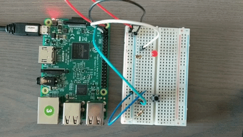
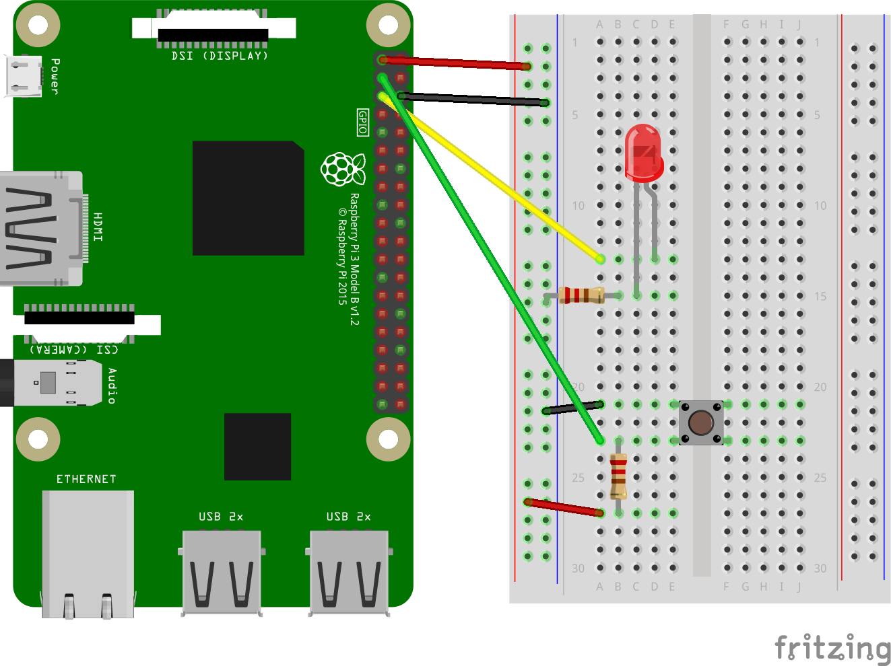

# Android ButtonThings
Pushbutton example using Android Things.

[Jump to HomeActivity.java source](ButtonThings/app/src/main/java/io/andrewgarner/buttonthings/HomeActivity.java)

### Components
1. [Raspberry Pi 3 Model B](https://www.adafruit.com/product/3055)
2. [Red LED](https://www.adafruit.com/product/299)
3. 2x [1k Ohm Resistor](https://www.adafruit.com/product/2975)
4. [Button](https://www.adafruit.com/product/367)
5. [Breadboarding Wires](https://www.adafruit.com/product/153)

### Schematic

