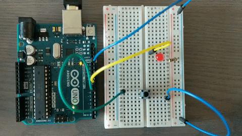
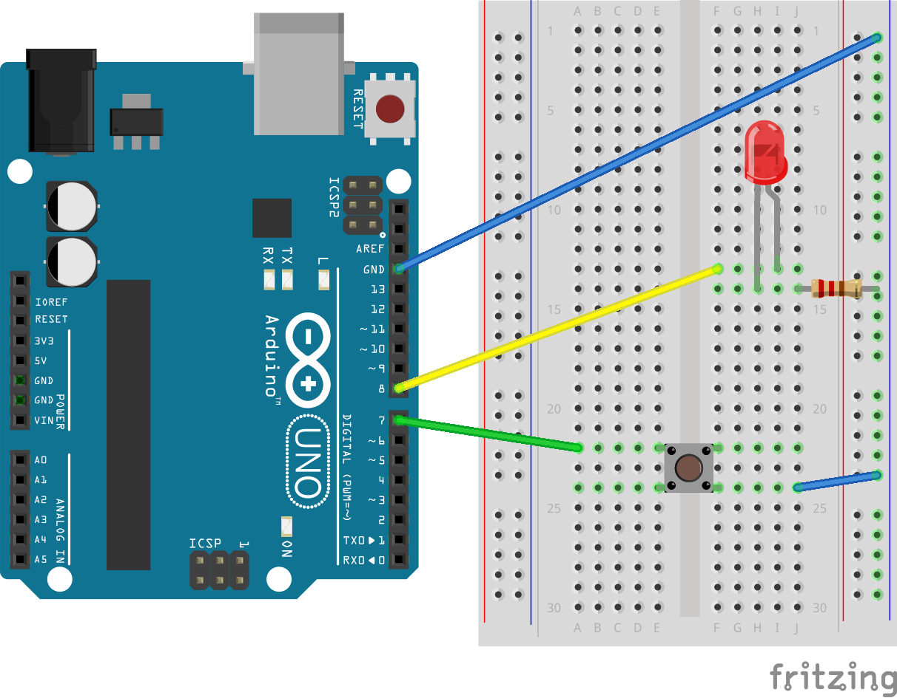

# Arduino ButtonThings
Pushbutton example using Arduino.

### Components
1. [Arduino Uno R3](https://www.adafruit.com/product/2488)
2. [Red LED](https://www.adafruit.com/product/299)
3. [1k Ohm Resistor](https://www.adafruit.com/product/2975)
4. [Button](https://www.adafruit.com/product/367)
5. [Breadboarding Wires](https://www.adafruit.com/product/153)

### Schematic

